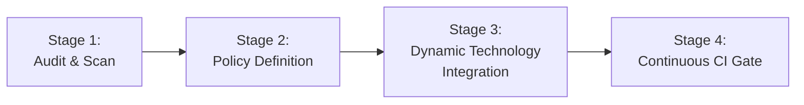

# Wellmanifest No-Hardcode Adoption & Migration Guide
## `wellmanifest/nohardcode@v1`

This guide details how repositories across the ecosystem adopt `wellmanifest/nohardcode` to systematically detect and replace hardcoded anti-patterns with proven dynamic solutions (LLM, JEV, Tesseract OCR, YOLO, Secrets Vault, and env-dsl).

---

## 1. Migration Roadmap

The migration process follows a four-stage unhardcoding lifecycle:



1. **Stage 1 (Audit & Scan)**: Run `nohardcode_check.py` to index all static smells, hardcoded coordinates, keywords, plaintext secrets, and brittle paths.
2. **Stage 2 (Policy Definition)**: Commit a repository `nohardcode-policy.json` conforming to `wellmanifest.nohardcode/policy/v1` specifying engine bindings and rule severity thresholds.
3. **Stage 3 (Dynamic Technology Integration)**: Replace static code paths with dynamic adapters:
   - NL keyword branches $\to$ Semantic router / Local LLM (`wellmanifest/nl-dsl-llm`).
   - Screen coordinates $\to$ YOLOv8/v11 UI object detection (`twinerd-vision`).
   - Canvas/VNC text $\to$ Tesseract OCR (`pytesseract`).
   - Decision branching $\to$ Declarative JEV policy expressions (`wellmanifest/policy-dsl`).
   - Credentials $\to$ Authenticated envelopes (`wellmanifest/secrets`).
   - Hardcoded ports & endpoints $\to$ Environment constants (`wellmanifest/env-dsl`).
   - Static sleep delays & timeouts $\to$ Adaptive EWMA latency & full jitter backoff (`wellmanifest/performance`).
   - Deep rigid dict/DOM parsing $\to$ Schema-tolerant recursive tree visitor (`wellmanifest/nl-dsl-llm`).
   - Hardcoded model names $\to$ Capability-based model router (`wellmanifest/llm`).
   - Rigid procedural pipelines $\to$ Declarative DAG task planners (`wellmanifest/poa`).
   - Display & accelerator assumptions $\to$ Dynamic socket & hardware capability probing (`wellmanifest/account-runtime`).
   - Static typo/ASR tables $\to$ Fuzzy phonetic matching & embedding similarity.
   - Fixed scoring weights $\to$ Multi-Armed Bandit feedback governors (`wellmanifest/saas-lifecycle`).
4. **Stage 4 (Continuous CI Gate)**: Add `nohardcode_check.py` to pre-commit (`prefact`) and `./project/governance-check.sh`.

---

## 2. Target Repositories & Concrete Playbooks

### A. `twinerd` (Desktop Vision & Visual Automation)
- **Current Anti-Pattern**: Static screen click coordinates (e.g. `click(1054, 432)`), fixed sleep intervals, and hardcoded home directory paths.
- **Remediation**:
  1. Replace hardcoded `click(x, y)` with YOLO UI detector:
     ```python
     # Before
     pyautogui.click(1054, 432)

     # After
     from twinerd.vision import YOLOElementDetector
     box = YOLOElementDetector("ui_v11.pt").find_element("submit_button")
     pyautogui.click(box.center_x, box.center_y)
     ```
  2. For visual text on canvas or VNC streams, use Tesseract OCR bounding box resolution.
  3. Replace `/home/tom/...` with `Path.home()` or lease directory from `wellmanifest/account-runtime`.

### B. `paxlet-com/willmux` (Multi-Node Terminal & NL Orchestrator)
- **Current Anti-Pattern**: Hardcoded natural language arrays (`["uruchom piosenke", "otworz youtube"]`), static ports `7070` and `8781`, raw `print()` statements.
- **Remediation**:
  1. Replace brittle string matching with LLM Semantic Intent Evaluator:
     ```python
     # Before
     if cmd in ["uruchom piosenke", "graj muzyke", "wlacz radio"]:
         play_media(cmd)

     # After
     from willmux.nl import SemanticRouter
     intent = SemanticRouter(engine="subllm").resolve_intent(cmd)
     if intent.name == "media.play":
         play_media(intent.slots.get("query"))
     ```
  2. Replace port literals `7070` with `os.getenv("WILLMUX_PORT", "7070")` conforming to `wellmanifest/env-dsl`.
  3. Replace `print()` with structured JSONL logger conforming to `wellmanifest/logs`.

### C. `paxlet-com/willman` (Accounting & Autonomous Operations)
- **Current Anti-Pattern**: Hardcoded VAT tax brackets, business logic `if/elif` ladders, and plaintext credential tokens.
- **Remediation**:
  1. Extract tax calculation and invoice routing into external JEV (JSON Expression Validator) rules:
     ```json
     {
       "rule": "tax_rate",
       "condition": {"==": [{"var": "country"}, "PL"]},
       "rate": 0.23
     }
     ```
  2. Store credentials in authenticated envelopes adhering to `wellmanifest/secrets`.

---

## 3. Tooling Integration

### Integration with `prefact`
Add `nohardcode_check.py` to the repository prefact configuration:
```yaml
# .prefact.yaml
checks:
  - id: nohardcode
    cmd: "python3 standard/nohardcode_check.py --policy nohardcode-policy.json"
    files: ["src/**/*.py", "src/**/*.ts"]
```

### Integration with `semcod/redup`
To eliminate copy-pasted blocks (`NOHARDCODE-010`):
1. Run `redup scan --min-tokens 50 --repo .` to identify duplicated AST fragments.
2. Extract common logic into `packages/core` or standalone micro-libraries adhering to `wellmanifest/reuse` and `wellmanifest/modularity`.

### Integration with Ticket & Governance Life Cycle
When `nohardcode_check.py` detects unhardcoding violations:
1. Generate planfile tickets:
   ```bash
   python3 standard/nohardcode_check.py --generate-tickets --output project/tickets/
   ```
2. Allocate worktree and ticket via `./project/new-ticket.sh` following `GEMINI.md` and `AGENTS.md`.
3. Submit remediation and verify clean pass (`GOV-PASS`).
