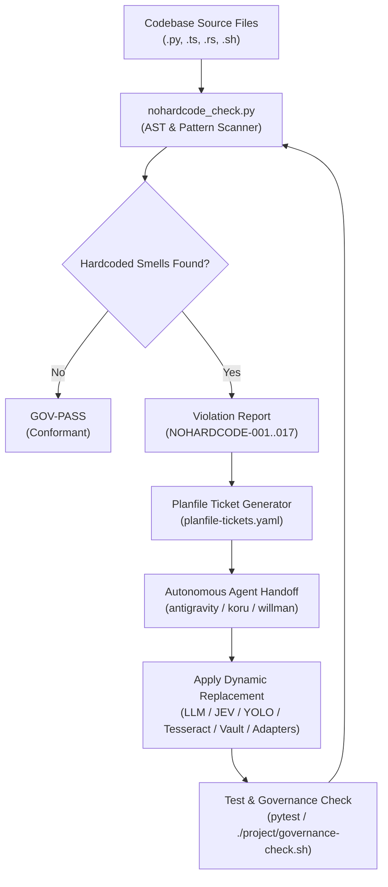

# Architecture & Ecosystem Boundary Matrix
## `wellmanifest/nohardcode@v1`

## 1. System Philosophy

`wellmanifest/nohardcode` defines the standard for **dynamic, resilient, and adaptive software construction**.
Hardcoding is the root cause of brittle automation, runtime crashes on minor UI changes, security vulnerabilities, and vendor lock-in.

This standard does not reinvent runtime tools (it does not build its own OCR engine or neural network). Instead, it establishes:
1. A **formal classification** of hardcoded smells.
2. A **normative contract** mapping each smell to verified dynamic technologies.
3. An **audit checker** to detect and report violations across codebases.
4. Seamless interoperability with existing `wellmanifest/*` domain packs.

---

## 2. HOME vs ADOPT (Boundary Matrix)

- `HOME` wellmanifest · `shape` domain_pack
- Cross-refs (ADOPT, do not duplicate):

| Concern | HOME | Role in Unhardcoding |
|:---|:---|:---|
| **Unhardcode Taxonomy & Detection Engine** | **this pack** | Normative classification, AST scanner, and dynamic technology mapping rules |
| **Dynamic Secrets & Credentials** | `wellmanifest/secrets` | AES-256-GCM encrypted envelopes, origin-bound access, short-lived bounded leases |
| **Dynamic Configuration & Environment** | `wellmanifest/env-dsl` | Language-neutral `SNAKE_CASE=value` constants, typed `.env` contract |
| **Structured Errors & Codified Runbooks** | `wellmanifest/logs` | CQRS JSONL streams, exact URI processes, error runbooks (`errors/{CODE}.md`) |
| **AST Deduplication & Reuse Engine** | `wellmanifest/reuse` | `semcod/redup` AST clone detection, `semcod/search` FTS5 index |
| **PII Anonymization & Synthetic Data** | `wellmanifest/anonym` | Data masking, pseudonymization, GDPR compliance |
| **Runtime Isolation & Path Portability** | `wellmanifest/account-runtime` | Bounded user workspace, sandboxed profiles, dynamic home directories |
| **Declarative Process URIs** | `wellmanifest/poa` | `proc://...` execution contracts replacing raw shell scripts |
| **Natural Language & Intent Models** | `wellmanifest/nl-dsl-llm` | Formal grammar and LLM intent translation contracts |
| **Adaptive Performance & Latency Budgets** | `wellmanifest/performance` | RTT tracking, exponential jitter, dynamic timeouts and token governors |
| **Autonomous Self-Healing Loops** | `wellmanifest/repair-lifecycle` | Reactive plan-act-observe-diagnose-repair execution loops |
| **Multi-Agent Decision Governance** | `wellmanifest/agent` | Capability-based agent routing and bandit feedback prioritization |

---

## 3. Data Flow & Autonomous Refactoring Loop

